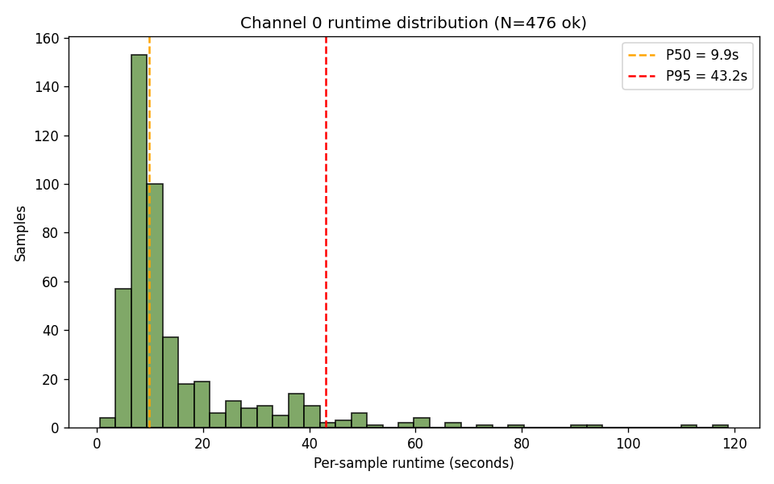
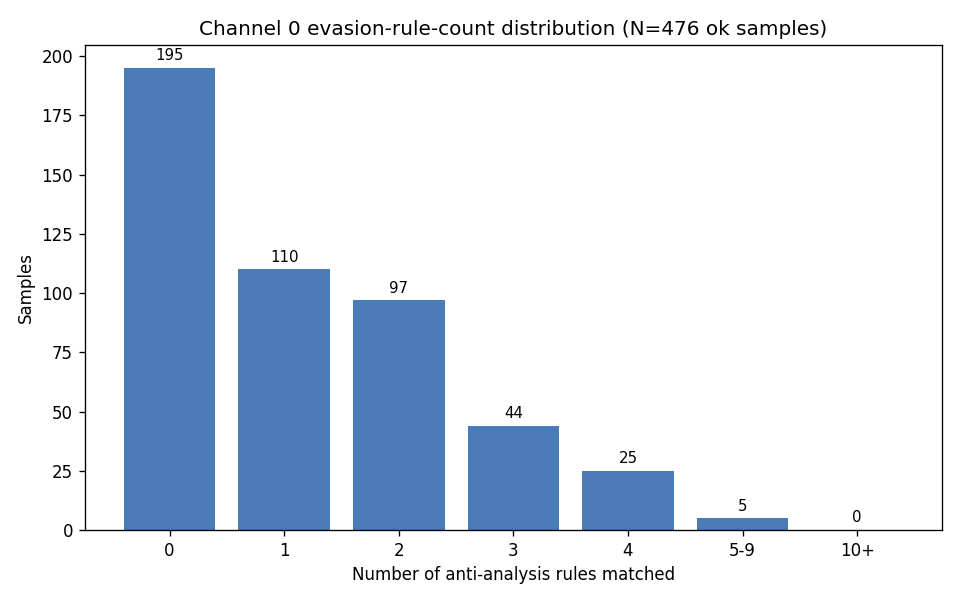
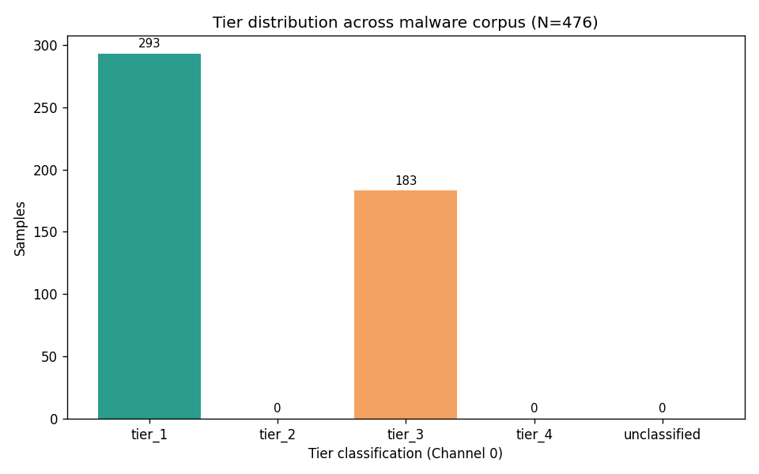
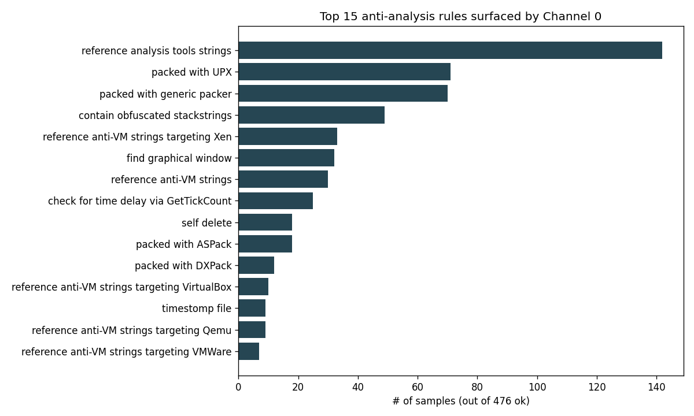
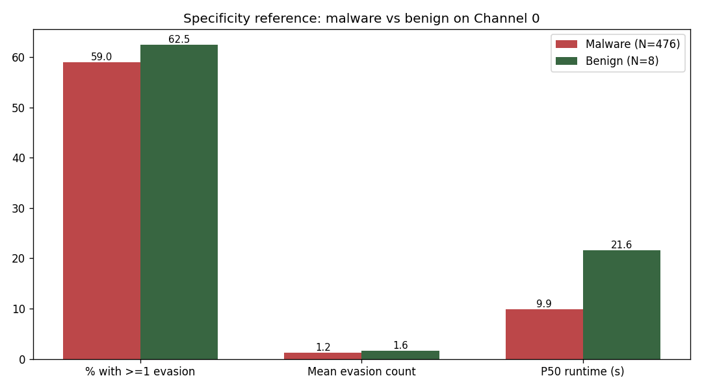

# Channel 0 at scale — 500-sample corpus characterization

_Generated by `scripts/analyze_channel0.py`._

## 1. Methodology

- **Corpus**: VirusTotal Academic PE32 samples across four archive dates (2017-10-20, 2017-11-20, 2020-05-06, 2021-11-03).
- **Sampling**: stratified random — `--per-date 125`, seed `42`, validated as 32-bit PE32 via libmagic.
- **N (malware)**: 500 processed records.
- **Benign control**: 11 binaries from `~/CAPEv2/analyzer/windows/` (signed Microsoft utilities, CAPE analysis tools).
- **Per-sample timeout**: 120s.
- **Versions pinned**: flare-capa 9.4.0, capa-rules @ `be59710a`, capa sigs @ `46188228`. (Pin drift will change matches.)
- **Framing**: this report characterizes **what Channel 0 (capa-wrapper) sees**, not evasion ground truth. Specificity is referenced against the benign control set.

## 2. Execution overhead

| metric | malware | benign |
|---|---:|---:|
| samples processed | 500 | 11 |
| ok | 476 | 8 |
| timeout | 23 | 3 |
| capa_error | 1 | 0 |
| parse_error | 0 | 0 |
| other_error | 0 | 0 |
| total ok runtime (s) | 7476.0 | 252.0 |
| P50 runtime (s) | 9.86 | 21.58 |
| P95 runtime (s) | 43.16 | 40.74 |
| mean runtime (s) | 15.71 | 31.50 |
| max runtime (s) | 118.79 | 105.47 |

**Extrapolation:** at the observed malware mean of 15.71s/sample, processing the full 78,515-sample VT corpus would take ~342.5 hr single-threaded (~85.6 hr at 4-way parallelism).

## 3. What Channel 0 sees at scale

Evasion-rule-count distribution across `ok` samples:

| # of anti-analysis rules matched | samples | % of ok |
|---|---:|---:|
| 0 | 195 | 41.0% |
| 1 | 110 | 23.1% |
| 2 | 97 | 20.4% |
| 3 | 44 | 9.2% |
| 4 | 25 | 5.3% |
| 5-9 | 5 | 1.1% |
| 10+ | 0 | 0.0% |

Tier mix:

| tier | count | % of ok |
|---|---:|---:|
| tier_1 | 293 | 61.6% |
| tier_2 | 0 | 0.0% |
| tier_3 | 183 | 38.4% |
| tier_4 | 0 | 0.0% |
| unclassified | 0 | 0.0% |

## 4. Top techniques surfaced

These are the most frequent anti-analysis rules Channel 0 matched across the corpus. They're the prioritization input for Channel 1 (FLOSS) and Channel 2 (Binary Ninja):

| rank | rule | matches | % of ok |
|---:|---|---:|---:|
| 1 | `reference analysis tools strings` | 142 | 29.8% |
| 2 | `packed with UPX` | 71 | 14.9% |
| 3 | `packed with generic packer` | 70 | 14.7% |
| 4 | `contain obfuscated stackstrings` | 49 | 10.3% |
| 5 | `reference anti-VM strings targeting Xen` | 33 | 6.9% |
| 6 | `find graphical window` | 32 | 6.7% |
| 7 | `reference anti-VM strings` | 30 | 6.3% |
| 8 | `check for time delay via GetTickCount` | 25 | 5.3% |
| 9 | `self delete` | 18 | 3.8% |
| 10 | `packed with ASPack` | 18 | 3.8% |
| 11 | `packed with DXPack` | 12 | 2.5% |
| 12 | `reference anti-VM strings targeting VirtualBox` | 10 | 2.1% |
| 13 | `timestomp file` | 9 | 1.9% |
| 14 | `reference anti-VM strings targeting Qemu` | 9 | 1.9% |
| 15 | `reference anti-VM strings targeting VMWare` | 7 | 1.5% |

## 5. Specificity floor (benign control)

Rate of anti-analysis rules firing on a known-benign control set vs the malware corpus. This is descriptive specificity — not formal accuracy, but it tells us whether capa's anti-analysis rules discriminate between populations.

| population | N (ok) | % with >=1 evasion rule | mean evasion count |
|---|---:|---:|---:|
| malware corpus | 476 | 59.0% | 1.19 |
| benign control | 8 | 62.5% | 1.62 |

## 6. Spotlight pair

### A — capa-rich sample

- **SHA-256**: `a7dee9936febe9a803d8e6db58e6e3f71aa1ca82c8938df4a63cb7707286918a`
- **Archive**: `2017-10-20`
- **Total capa rules matched**: 57
- **Anti-analysis rules** (8): `acquire debug privileges`, `contain obfuscated stackstrings`, `find graphical window`, `reference analysis tools strings`, `reference anti-VM strings targeting Parallels`, `reference anti-VM strings targeting VMWare`, `reference anti-VM strings targeting VirtualBox`, `timestomp file`
- **Tier**: `tier_3`
- **Runtime**: 8.82s
- **VT descriptive tags**: `ALYac: Gen:Variant.Zusy.Elzob.8654`, `CAT-QuickHeal: Trojan.Beaugrit.S16628`, `MicroWorld-eScan: Gen:Variant.Zusy.Elzob.8654`, `VIPRE: Trojan.Win32.Generic!BT`, `peexe`, `suspicious-dns`

### B — capa-empty sample

- **SHA-256**: `c3f4d495604396053c1181fc8538dcdeb47d60b55e093d4523920936e2449ee6`
- **Archive**: `2017-10-20`
- **Total capa rules matched**: 22
- **Anti-analysis rules**: 0 (capa found no evasion signal)
- **Tier**: `tier_1`
- **Runtime**: 9.22s
- **VT descriptive tags**: `Malwarebytes: Trojan.Agent.ALTV`, `McAfee: Packed-DG!B7EA40518B0C`, `MicroWorld-eScan: Gen:Variant.Zusy.138181`, `VIPRE: Trojan.Win32.Carberp.i (v)`, `overlay`, `peexe`
- **Interpretation note**: AV engines (above) report on this sample independently of capa. If the descriptive tags suggest evasion-flavored behavior but Channel 0 caught nothing, this sample is a candidate for Channels 1 (FLOSS) and 2 (BN) to fill in. AV labels are noisy and used here only for context, not as ground truth.

## 7. Implications for Channel 1 (FLOSS) and beyond

- **Capa's most-frequent anti-analysis hits** (`reference analysis tools strings`, `packed with UPX`, `packed with generic packer`, `contain obfuscated stackstrings`, `reference anti-VM strings targeting Xen`) are the high-volume techniques in this corpus. Channel 1 (FLOSS) and Channel 2 (BN) should treat these as priority targets for per-call-site enrichment, since these are where the downstream fuzzer will see the most call sites.
- **41.0% of `ok` samples (195 samples) matched zero anti-analysis rules.** These are the candidates for Channel 1 to surface evasion that's expressed via decoded/stackstring data capa can't decode statically — the breadth-gap for FLOSS.
- **Tier-3 samples (183, 38.4%)** have at least one capa anti-analysis rule that isn't yet in `CAPA_RULE_TO_APIS`. Each unmapped rule is a small piece of week-9 derivation work — the size of that unmapped-rule set across the corpus is a concrete scope estimate for that future task.
- **Timeout rate: 4.6% (23 samples)** hit the 120s ceiling. These are capa's edge cases — likely heavy packers, large overlays, or pathological control flow. They are themselves a Clew finding: samples too expensive for static-only analysis are precisely where dynamic Channel 4 (DRIO) has to take over.

## 8. Honest limitations

- **No ground truth.** Channel 0's spec is "what capa sees". This report characterizes that. We did not validate per-sample whether capa was right or wrong.
- **N=500 isn't "the malware ecosystem."** Stratified random across 4 dates spanning 2017–2021 on VT Academic samples; descriptive only.
- **Capa is a black box at the pinned versions.** Rule drift in `mandiant/capa-rules` would change these numbers.
- **Benign control is small (N=11) and biased** toward Microsoft-signed analysis tools; not a representative random benign baseline.
- **VT metadata is noisy.** AV-engine labels are vendor-dependent and used here only for descriptive context in the spotlight pair, never as a ground-truth label.

---

_Source data: `results/channel0_at_scale/malware_results.jsonl` (500 records), `results/channel0_at_scale/benign_results.jsonl` (11 records). Stats CSV: `results/channel0_at_scale/stats.csv`._